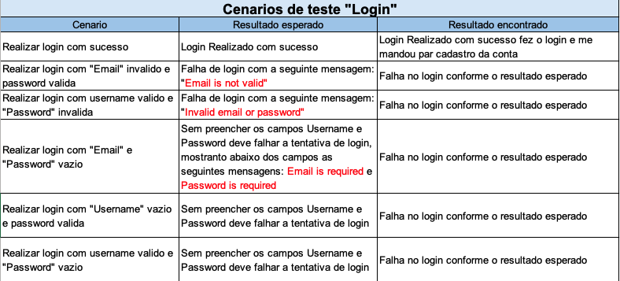
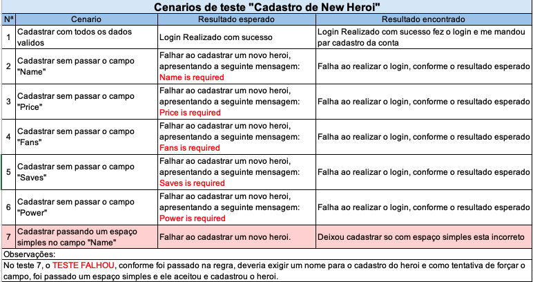
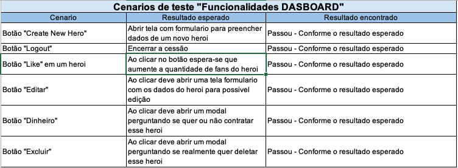
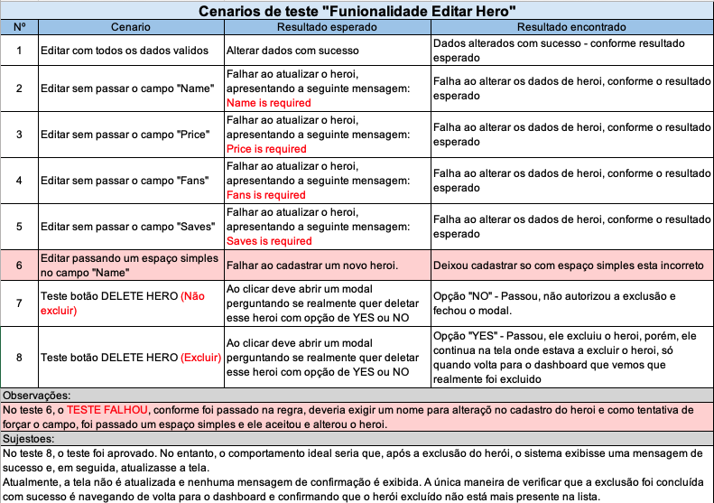
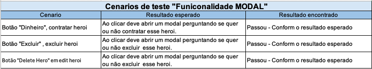

# Web automation with cy.heroes

I created end-to-end (E2E) and component tests, validating user interactions and critical application flows to ensure everything works as expected.  
The goal is to demonstrate how to structure and execute automated frontend tests, improving reliability and delivery quality. 🚀

## Tests

All frontend test code is located in the `client` folder:

- **E2E tests** – validate complete user flows  
- **Component tests** – ensure individual UI elements behave correctly  

Tests are implemented with **Cypress**, demonstrating best practices in frontend test automation.

This is a demo application that shows how to use Cypress to run end-to-end,
component, and API tests against an application.

## Getting Started

The app is a mono repo that uses npm workspaces. Once you clone the project,
install the dependencies at the root folder:


```sh
npm install
```

After that a few more things need to be set up (databases and such), to do so run:

```sh
npm run setup
```


To launch the app for development, run:

```sh
npm run dev
```

This will start both the client and server apps in dev mode. The site will be
available at http://localhost:3000.

## ▶️ Running the Tests

To execute the Cypress tests, follow the steps below:

### Open Cypress Test Runner (interactive mode)
```bash
npx cypress open
````


## 🛠 Technologies Used

- [Cypress]
- [Node.js]
- [TypeScript]
- [GitHub]

## 📂 Project Structure

All test files are located in the `client` folder:

## 📊 Test Scenarios

Below are the test scenarios designed for this project.  
They were organized in spreadsheets to provide a clear view of the coverage, expected results, and validation steps.  

The following images illustrate the test scenarios used during the automation process:







## Environment Variables

The client app uses an environment variable to know what the URL is for the
backend api named `VITE_API_URL`. It defaults to "http://localhost:3001" for use
in dev mode, and should be overriden in other environments/modes.
